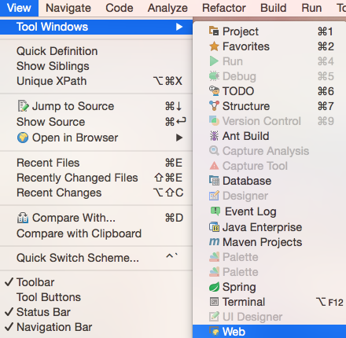
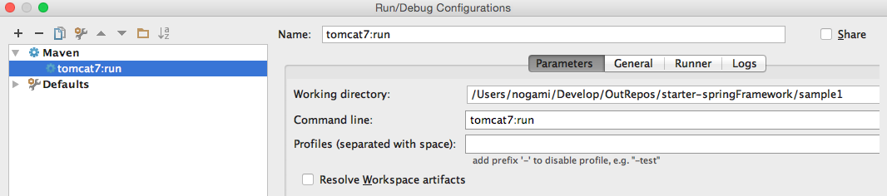

# setup-spring

## 概要

### プロジェクトディレクトリの作成
```
$ mkdir sample1
$ mkdir -p sample1/src/main/java
$ mkdir -p sample1/src/main/resources
$ mkdir -p sample1/src/main/webapp
```

### mavenの設定

```
$ cd sample1/
$ vim pom.xml
...
<?xml version="1.0" encoding="UTF-8"?>
<project xmlns="http://maven.apache.org/POM/4.0.0"
         xmlns:xsi="http://www.w3.org/2001/XMLSchema-instance"
         xsi:schemaLocation="http://maven.apache.org/POM/4.0.0 http://maven.apache.org/xsd/maven-4.0.0.xsd">
    <modelVersion>4.0.0</modelVersion>

    <packaging>war</packaging>
    <groupId>gyamin.sample1</groupId>
    <artifactId>sample1</artifactId>
    <version>1.0-SNAPSHOT</version>
...
```

### IntelliJ IDEA設定
Openからsample1ディレクトリを選択してプロジェクトを作成する。       

View > Tool Windows からMavenを選択してMavenToolをプロジェクトに表示する。      


Edit Configuration から新規の設定でMavenを選択し、Run/Debug設定を行う。



### HelloWorldの作成

##### ディレクトリ作成
```
$ mkdir -p src/main/webapp/WEB-INF
$ mkdir -p src/main/webapp/WEB-INF/jsp
```

##### web.xmlの作成

```
$ cat web.xml 
<?xml version="1.0" encoding="UTF-8"?>
<web-app xmlns:xsi="http://www.w3.org/2001/XMLSchema-instance" xmlns="http://java.sun.com/xml/ns/javaee" xsi:schemaLocation="http://java.sun.com/xml/ns/javaee http://java.sun.com/xml/ns/javaee/web-app_3_0.xsd" version="3.0">
    <display-name>sample1</display-name>
    <welcome-file-list>
        <welcome-file>index.jsp</welcome-file>
    </welcome-file-list>

    <servlet>
        <servlet-name>dispatcher</servlet-name>
        <servlet-class>
            org.springframework.web.servlet.DispatcherServlet
        </servlet-class>
        <load-on-startup>1</load-on-startup>
    </servlet>
    <servlet-mapping>
        <servlet-name>dispatcher</servlet-name>
        <url-pattern>/</url-pattern>
    </servlet-mapping>

</web-app>
```

##### xxxx-servlet.xmlの作成

```
$ cat dispatcher-servlet.xml 
<?xml version="1.0" encoding="UTF-8"?>
<beans xmlns="http://www.springframework.org/schema/beans"
       xmlns:xsi="http://www.w3.org/2001/XMLSchema-instance" xmlns:context="http://www.springframework.org/schema/context"
       xsi:schemaLocation="http://www.springframework.org/schema/beans
http://www.springframework.org/schema/beans/spring-beans-4.0.xsd
http://www.springframework.org/schema/context
http://www.springframework.org/schema/context/spring-context-4.0.xsd">
    <context:component-scan base-package="gyamin.sample1.controller" />
    <bean
            class="org.springframework.web.servlet.view.InternalResourceViewResolver">
        <property name="prefix" value="/WEB-INF/jsp/" />
        <property name="suffix" value=".jsp" />
    </bean>
</beans>
```